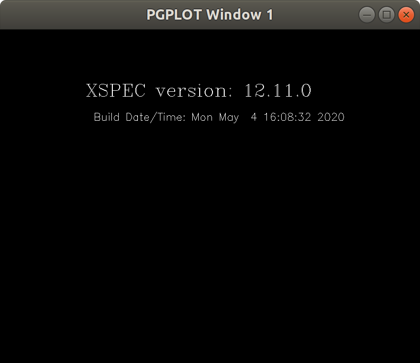

# XSPEC Introduction

XSPEC is a command line software packaged used for spectral analysis of X-ray observations. It can be used with a variety of X-ray observatories, including NICER.

There is also a Python implementation, PyXSPEC. Here, we focus only on the command line program. We also include discussion on how to use XSPEC in Python with `pexpect`.

[Papers by Keith Arnaud on XSPEC development](https://ui.adsabs.harvard.edu/search/filter_author_facet_hier_fq_author=AND&filter_author_facet_hier_fq_author=author_facet_hier%3A%220%2FArnaud%2C%20K%22&fq=%7B!type%3Daqp%20v%3D%24fq_author%7D&fq_author=(author_facet_hier%3A%220%2FArnaud%2C%20K%22)&q=title%3A%22XSPEC%22&sort=date%20desc%2C%20bibcode%20desc&p_=0)

## Requirements
XSPEC is included in HEAsoft. Therefore, if the relevant HEAsoft information is included in the .bashrc, XSPEC should be able to be called from the command line. 

The CALDB database is also required. Again, this is part of the HEASARC software, and the CALDB, CALDBCONFIG, and CALDBALIAS environmental variables should be defined. 

Information on HEAsoft installation can be found [here](https://heasarc.gsfc.nasa.gov/lheasoft/install.html).

CALDB documentation can be found [here](https://heasarc.gsfc.nasa.gov/docs/heasarc/caldb/caldb_doc.html). 

For those working on the Haverford Cluster, HEAsoft and CALDB are already installed. As of June 2020, the current HEAsoft version is 6.27.2. The following lines can be added to the .bashrc file:

```
export HEADAS=/packages/heasoft-6.27.2/x86_64-pc-linux-gnu-libc2.23
alias heainit=". $HEADAS/headas-init.sh"
heainit

CALDB=/packages/heasoft-6.27.2/caldb; export CALDB
CALDBCONFIG=$CALDB/software/tools/caldb.config; export CALDBCONFIG
CALDBALIAS=$CALDB/software/tools/alias_config.fits; export CALDBALIAS
```

XSPEC can be launched on the command line by simply typing `xspec`. This will bring up a command promt `XSPEC12>`. 

To exit XSPEC at any time, simply type `exit`.

## Example Data Set

In this guide we will use an emission spectra from millisecond pulsar PSR B1937+21. The spectrum file is 1937spectrum.pha. 

We will also need three other files:
* nixtiref20170601v001.rmf
* nixtiaveonaxis20170601v002.arf
* background.pha

The usage of these files is explained below in the 'Instrument Response' and 'Background Spectra' sections. 

## Loading spectra into XSPEC

Launch XSPEC on the command line by typing `xspec`. This will bring up version information and a prompt `XSPEC12>`


Before analyzing a spectra, it is typically good to create a log file. This will save all the commands and output run during the interactive XSPEC session to a file. Later in this guide, we discuss how this can be parsed with Python. To create a log file, type `log` and the name of the logfile.
```
XSPEC12> log 1937_logfile.txt
```
We are now ready to load in our pulsar emission spectrum. XSPEC allows for multiple data sets or observations to be modeled independently, so spectra are numbered when loaded in. For our purposes, this simply means that we are assigning our spectra to the first spectrum position. To load the data, type
```
XSPEC12> data 1 1937spectra.pha
```
The output will show some information about the spectrum:


XSPEC gave us a warning here -- we're missing a response file. Depending on how you've generated a spectrum, this warning may or may not show up. In the next section, we go over what a response file does and how to load it into XSPEC. 

### Instrument Response

Here is some text from Dom's thesis about the instrument response:

> When we observe an X-ray source, the recorded data is the number of photons detected in each instrument channel $n$ (Arnaud, 1999). This is related to the intrinsic spectrum of the source, ), where  is energy, and the response function of the instrument, ), by
> 
> %20%3D%20%5Cint_0%5E%7B%5Cinfty%7D%20f(E)%20R(n%2CE)%5C%20dE)
> 
> In reality, we don't have a continuous function for ), but rather a matrix that defines a discrete function defined as
> 
> %20%3D%20%5Cfrac%7B%5Cint_%7BE_%7Bm-1%7D%7D%5E%7BE_m%7D%20R(n%2CE)%5C%20dE%7D%7BE_m%20-%20E_%7Bm-1%7D%7D)
> 
> where  is the index of the energy range. 

In other words, a response matrix allows us to relate the energy channel of the photon with the energy in units of keV. [Page, M. (2015)](https://arxiv.org/abs/1506.07015) has a good description of the relation. 

Where can we find a response matrix? The NICER instrument response can be found in the calibration database (part of the HEAsoft installation). It can be found on the Haverford cluster at /packages/caldb/data/nicer/xti/cpf/rmf/nixtiref20170601v001.rmf. It is also included in this github directory. 

To apply the instrument response, we ue the command `resp`. We want to apply our response file to the first spectrum in our XSPEC session. Therefore we write:
``` 
XSPEC12> resp 1 nixtiref20170601v001.rmf
```
There is also an ancillary response file. This file contains information about the effective area of the detector. This is also found in CALDB, at /packages/caldb/data/nicer/xti/cpf/arf/nixtiaveonaxis20170601v002.arf. Again, this file is also included in the github directory. We load the ARF in a way similar to the response file:
 ```
 XSPEC12> arf 1 nixtiaveonaxis20170601v002.arf
 ```
 If both of these commands were successful, we see
 
 
 

## Plotting Data

XSPEC allows us to plot the spectra and in a variety of forms, both with and without a fit model. First, we have to choose a plot device. The following command will bring up a plotting window

```
XSPEC12> cpd /xs
```
The window that appears should look like this:


The first thing we can do is simply plot the data:
```
XSPEC12> plot data
```
This will update the plot window and should look something like this


Even though we've added the instrument response and ARF, we still have the channel axis on the bottom. If we want to plot the energy, we can adjust the axis with `setplot`
```
XSPEC12> setplot energy
```
We can then refresh the plot
```
XSPEC12> plot
```
This should now show an energy axis. 
## Background spectra

## Ignoring Channels / Energy Ranges

## Fitting a Model

### Choosing a model

### Computing errors

### Plotting the model

## Plotting Spectra in Python

## Using Log Files
